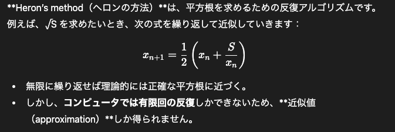

## 進数変換

### Al-Khwarizmi and Euclid
🧠 Al-Khwarizmi（アル・フワーリズミ）

生没年：約780–850年（ペルシャ出身の数学者）

活躍場所：バグダッドの「知恵の館（House of Wisdom）」

業績：

“Algorithm（アルゴリズム）”の語源となった人物。
→ 彼の名前「al-Khwarizmi（アル・フワーリズミ）」がラテン語で「Algoritmi」となり、そこから「algorithm（計算手順）」という言葉が生まれました。

**代数学（algebra）**を体系化した。
→ 彼の著書『Al-Kitab al-Mukhtasar fi Hisab al-Jabr wal-Muqabala』が「al-jabr（復元・補完）」から algebra（代数学） という言葉の語源になりました。

意義：

現代のアルゴリズム、代数、計算手順の概念の基礎を築いた人物。

コンピュータサイエンスの「手順的思考」の祖先とも言われます。

📐 Euclid（ユークリッド）

生没年：約紀元前300年（古代ギリシャの数学者）

活躍場所：アレクサンドリア（エジプト）

業績：

**『原論（Elements）』**という13巻の書物を執筆。
→ 幾何学（geometry）の体系を初めて論理的に整理した。

ユークリッドの互除法（Euclidean algorithm）を発明。
→ 2つの数の最大公約数（GCD）を求める方法で、今日でもアルゴリズムの古典的例として教科書に登場します。

意義：

論理的推論と定義・公理・証明という数学の形式を確立。

現代のプログラム構造（定義→手順→結論）にも通じる考え方を残しました。

### Heron's method

