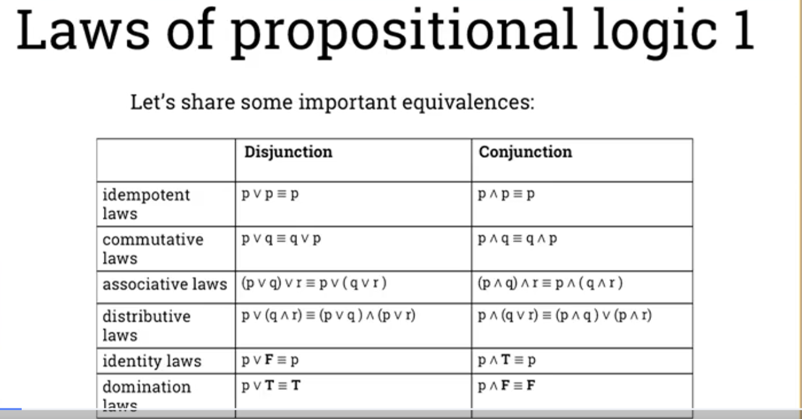
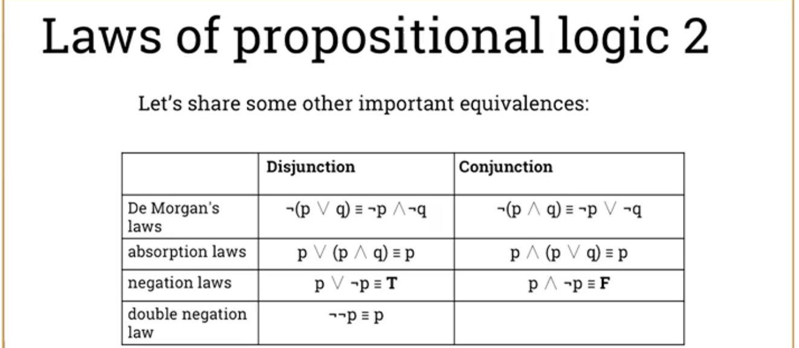

# laws of propositional logic

## 1. Idempotent laws（冪等律）

- **Disjunction（または）**  
  \( p \lor p \equiv p \)  
  同じ命題を「または」で結んでも元の命題と同じ。

- **Conjunction（かつ）**  
  \( p \land p \equiv p \)  
  同じ命題を「かつ」で結んでも元の命題と同じ。

## 2. Commutative laws（交換律）

- **Disjunction**  
  \( p \lor q \equiv q \lor p \)  
  命題の順序を「または」で入れ替えても結果は同じ。

- **Conjunction**  
  \( p \land q \equiv q \land p \)  
  命題の順序を「かつ」で入れ替えても結果は同じ。

## 3. Associative laws（結合律）

- **Disjunction**  
  \( (p \lor q) \lor r \equiv p \lor (q \lor r) \)  
  「または」で結ばれた命題群の結合順序は任意に変更可能。

- **Conjunction**  
  \( (p \land q) \land r \equiv p \land (q \land r) \)  
  「かつ」で結ばれた命題群の結合順序は任意に変更可能。

## 4. Distributive laws（分配律）

- **Disjunction**  
  \( p \lor (q \land r) \equiv (p \lor q) \land (p \lor r) \)  
  「または」は「かつ」に分配可能。

- **Conjunction**  
  \( p \land (q \lor r) \equiv (p \land q) \lor (p \land r) \)  
  「かつ」は「または」に分配可能。

## 5. Identity laws（単位元の法則）

- **Disjunction**  
  \( p \lor F \equiv p \)  
  命題と偽（F）の「または」は、元の命題になる。

- **Conjunction**  
  \( p \land T \equiv p \)  
  命題と真（T）の「かつ」は、元の命題になる。

## 6. Domination laws（支配律）

- **Disjunction**  
  \( p \lor T \equiv T \)  
  命題と真（T）の「または」は、常に真（T）になる。

- **Conjunction**  
  \( p \land F \equiv F \)  
  命題と偽（F）の「かつ」は、常に偽（F）になる。

## 1. De Morgan's laws（ド・モルガンの法則）

- **Disjunction（または）**  
  \( \neg (p \lor q) \equiv \neg p \land \neg q \)  
  「pまたはq」の否定は、「pの否定かつqの否定」と等価。

- **Conjunction（かつ）**  
  \( \neg (p \land q) \equiv \neg p \lor \neg q \)  
  「pかつq」の否定は、「pの否定またはqの否定」と等価。

## 2. Absorption laws（吸収律）

- **Disjunction**  
  \( p \lor (p \land q) \equiv p \)  
  命題pと「pかつq」の「または」は、pだけに吸収される。

- **Conjunction**  
  \( p \land (p \lor q) \equiv p \)  
  命題pと「pまたはq」の「かつ」は、pだけに吸収される。

## 3. Negation laws（否定の法則）

- **Disjunction**  
  \( p \lor \neg p \equiv T \)  
  命題とその否定の「または」は、常に真(T)。

- **Conjunction**  
  \( p \land \neg p \equiv F \)  
  命題とその否定の「かつ」は、常に偽(F)。

## 4. Double negation law（二重否定の法則）

- \( \neg \neg p \equiv p \)  
  命題の否定をさらに否定すると、元の命題に戻る。
